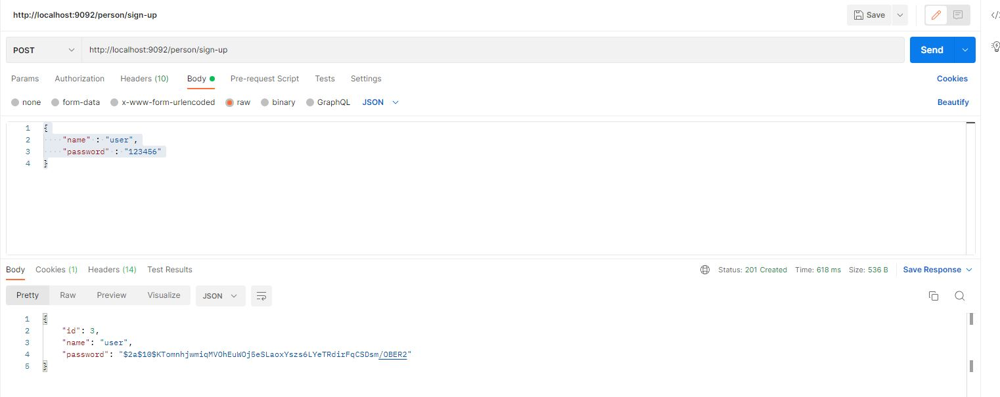
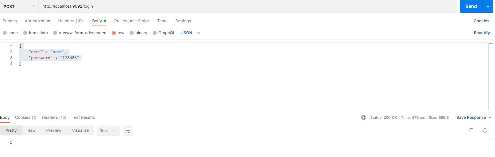
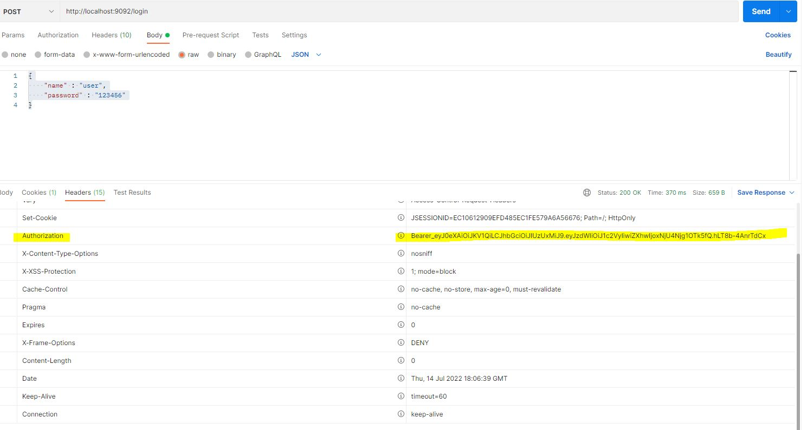
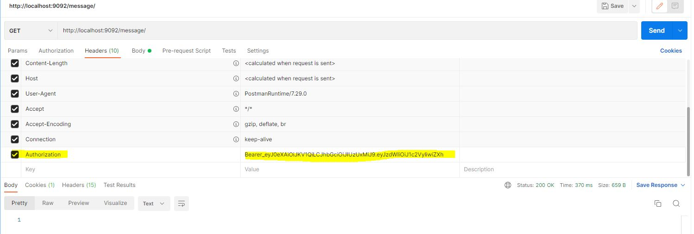
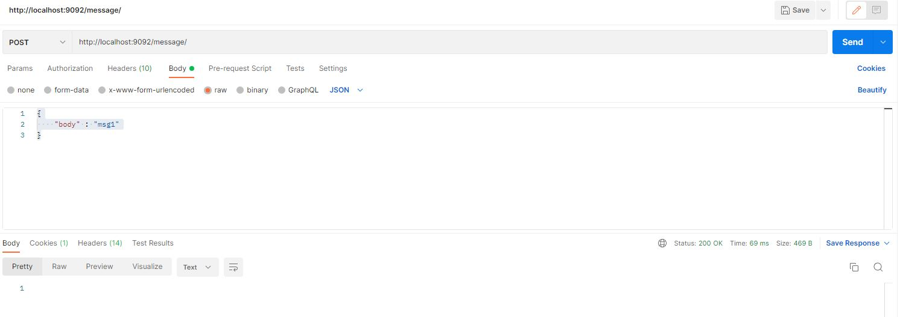
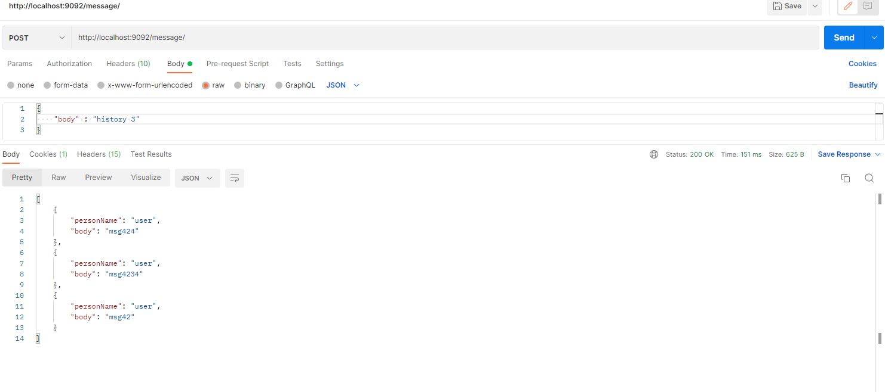

# test task for company "INSIDE"

Задание смотри в файле Task.  

cURL команды смотри в файле CurlCommands.


### Функции

**1. Регистрация пользователя**  

POST запрос
```
http://localhost:9092/person/sign-up 
```

```
{
"name" : "user",
"password" : "123456"
}
```



**2. Вход в систему**  

POST запрос

```
http://localhost:9092/login 
```

```
{
"name" : "user",
"password" : "123456"
}
```



**3. Скопировать токен из заголовка Authorization ответа**  



**4. Во всех запросах должен быть заголовок Authorization со значением токена**  



**5. Опубликовать сообщение**  

POST запрос

```
http://localhost:9092/message/
```
```

{
"body" : "msg1"
}
```



**5. Посмотреть историю сообщений пользователя**  

POST запрос

```
http://localhost:9092/message/
```
```

{
"body" : "history"
}
```


**5. Вывести n последних сообщений пользователя**  

POST запрос

```
http://localhost:9092/message/
```

```
{
"body" : "history 3"
}
```



